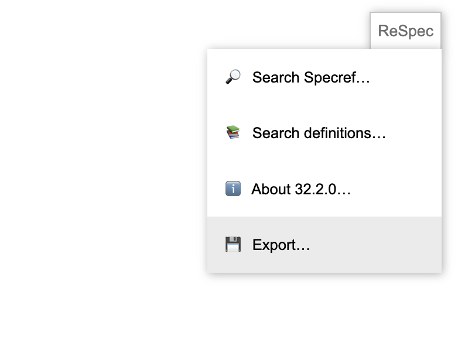

# cg-reports

This repository is for <a href="https://www.w3.org/community/">W3C Community and Business Groups</a> to manage and publish <a href="https://www.w3.org/community/reports/">final reports</a>. These reports are expected to comply with the [CG Report Requirements](https://www.w3.org/community/reports/reqs/).

Reports managed through this repository are mirrored on w3.org. Once a document appears on w3.org, it can be registered in the W3C system as a Final Specification; see more about [how to publish a report](https://www.w3.org/community/about/faq/#how-do-we-publish-a-report).

# Usage

To publish a final report.

1.  If your document is developed using <a href="https://github.com/w3c/respec">ReSpec</a>, please provide the static output rather than the dynamic source file.
    For example:
    

1.  Open a pull request that provides the report content under a directory with the following convention:
    `<cgshortname>/CG-FINAL-<reportshortname>-<YYYYMMDD>/` where `<cgshortname>` is the shortname of the group, `<reportshortname>` is a name of the group's choosing (particularly useful if the group manages several reports), and `<YYYYMMDD>` is the publication date.
1.  Ensure this directory contains a single `index.html` file.

Once merged by the W3C Community Lead, that content will then be available under the URL `https://www.w3.org/community/reports/<cgshortname>/CG-FINAL-<reportshortname>-<YYYYMMDD>/`.

# Check

The W3C CG Support team typically verifies that CG reports use the right naming conventions and the valid template (CG logo, no W3C logo, SOTD disclaimer).
